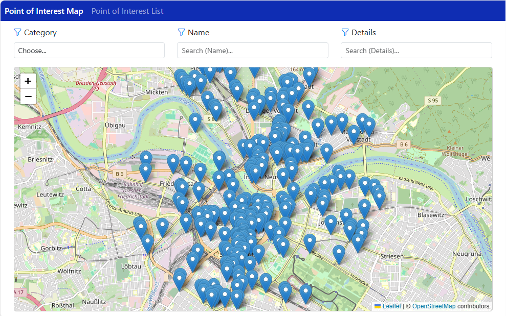
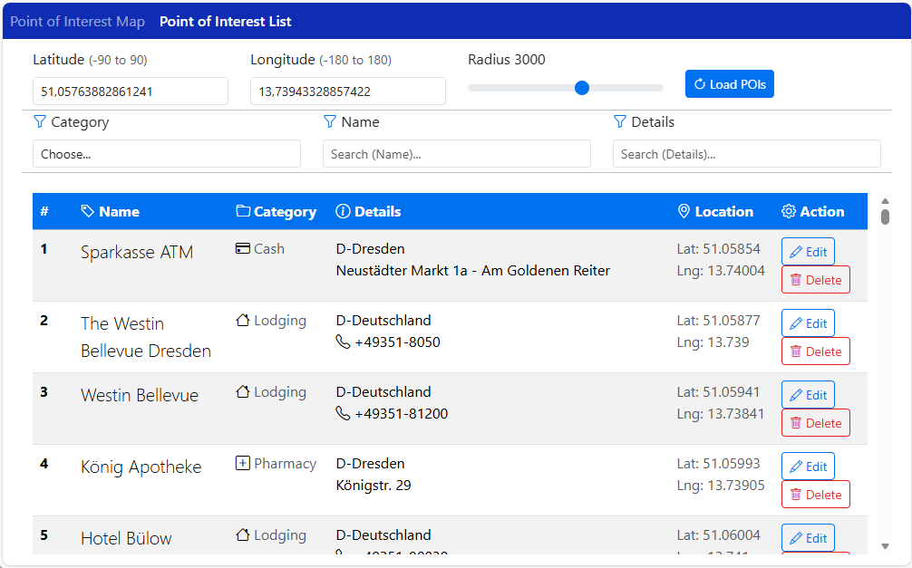

# MongoDB Showcase

[](#license)
[](#)

This repository is a demo application used for an internal campus showing the usage of MongoDBs geospatial index capabilities. The database stores points of interest (POI) that are shown on a map on frontend websites. The websites call backend services that connect to the MongoDB database. To show different ways of working with MongoDB, multiple backend technologies (.NET Core, JEE/Jakarta, Spring) and frontend technologies (Angular, ASP.NET Core MVC) are included in the repo.

## Table of Contents
- [AI-Assisted Code Generation](#ai-assisted-code-generation)
- [Quickstart](#quickstart)
- [Prerequisites](#prerequisites)
- [Run the demo (fast path)](#run-the-demo-fast-path)
- [Subprojects / Layout](#subprojects--layout)
- [Test data](#test-data)
- [Development notes](#development-notes)
- [License](#license)
- [Contact](#contact)

## AI-Assisted Code Generation

This project includes code that has been partially generated or written using artificial intelligence (AI) tools. These AI tools have been utilized to enhance productivity, ensure code quality, and expedite development processes. While AI has contributed to the creation of certain segments of the code, all outputs have been thoroughly reviewed and tested by human developers to ensure accuracy and reliability.

### AI Tools Used

- [GitHub Copilot Business](https://github.com/features/copilot): Utilized to assist in code completion and generation, enhancing developer productivity and code quality. GitHub Copilot Business offers advanced features tailored for enterprise use, including compliance and administrative controls.

### Human Review and Testing

Despite the involvement of AI in code generation, every piece of code has undergone rigorous review and testing by our development team. This ensures that the code meets our quality standards and functions as intended within the project.

### Acknowledgments

We acknowledge the advancements in AI technology that have made these tools available and appreciate the support they provide in modern software development.

For any questions or concerns regarding the AI-generated code, please feel free to contact us.

## Quickstart

These steps will get a local demo running (frontend + example backend + local MongoDB).

1. Start MongoDB (from the `MongoDB` folder)
   - Windows PowerShell:
     ```
     docker-compose -f [docker-compose.yml](http://_vscodecontentref_/6) up -d
     ```
   - Confirm MongoDB is up:
     ```
     docker ps
     ```
   - Of course you can use any other MongoDB installation.
   - For more information (i.e. database prerequisites) see the folders README.

2. Start a backend and a frontend:
   - See each subproject README for exact commands and ports (examples below).
   - The backends are configured to run under http://localhost:8080/zdi-geo-service/api/
   - Swagger for the backends is available under http://localhost:8080/zdi-geo-service/swagger/

3. Open a frontend in your browser:
   - Angular frontend: http://localhost:4200  
   - ASP.NET Core frontend: http://localhost:4200 (same port for consistency)

<figure style="text-align:center;">
  <a href="media/screenshots/frontend_screenshot.png" target="_blank" rel="noopener">
    
  </a>
  <figcaption style="font-size:0.95em;color:#444;margin-top:6px;">
    Frontend demo: POIs loaded relative to the map center — click to view full-size.
  </figcaption>
</figure>

<figure style="text-align:center;">
  <a href="media/screenshots/frontend_screenshot_list.png" target="_blank" rel="noopener">
    
  </a>
  <figcaption style="font-size:0.95em;color:#444;margin-top:6px;">
    Frontend demo: List of POIs loaded with the given coordinates — click to view full-size.
  </figcaption>
</figure>

## Prerequisites
- Docker & Docker Compose (when using the provided Docker files).
- Node.js (for the Angular frontend) and npm/yarn
- Java 21+ and Maven (for the JEE / Spring backend and the testdata generator)  
- .NET 9.0 SDK (for the .NET backend and ASP.NET Core frontend)

Its not necessary to have all technologies - select the frontend and backend of your choice.

## Run the demo (fast path — suggested)

### Choose Your Stack
This demo offers multiple technology combinations:

**Frontend Options:**
- **Angular** (`angular-maps-frontend/`) - SPA with TypeScript
- **ASP.NET Core MVC** (`dotnet-maps-frontend/`) - Server-side rendering with Razor
  - ✅ Full CRUD operations (Create, Edit, Delete POIs)
  - ✅ Right-click context menu on map markers
  - ✅ Advanced filtering (Name, Details, Category)
  - ✅ Dual list views (Cards/Table)
  - ✅ 138 unit tests with 100% pass rate

**Backend Options:**  
- **JEE/Jakarta** (`jee-mongodb-backend/`) - Traditional enterprise Java
- **.NET Core** (`dotnet-mongodb-backend/`) - Modern C# async API
  - ✅ 121 unit tests with 100% pass rate
  - ✅ High-performance async operations
  - ✅ 85.6% code coverage
- **Java Spring** (`spring-mongodb-backend`) - Spring Boot technology

### Quick Start Steps
- Start MongoDB:
  - PowerShell:
    ```
    cd MongoDB
    docker-compose up -d
    ```
- Run a backend (choose one):
  - **JEE Backend** (example):
    ```
    cd jee-mongodb-backend
    mvn clean package
    # deployment will depend on how the JEE war is executed; see the sub-README
    ```
  - **OR .NET Backend**:
    ```
    cd dotnet-mongodb-backend  
    dotnet run
    ```
  - **OR Spring Backend**:
    ```
    cd spring-mongodb-backend
    mvn clean package
    mvn spring-boot:run
    ```
- Run a frontend (choose one):
  - **Angular Frontend**:
    ```
    cd angular-maps-frontend
    npm install
    npm start
    ```
  - **OR ASP.NET Core Frontend**:
    ```
    cd dotnet-maps-frontend
    dotnet run
    # Access at: http://localhost:4200/Map
    ```

Note: exact ports and steps vary by backend. See the subproject READMEs for full, correct commands.

## Subprojects / Layout

- `angular-maps-frontend` — Angular app that displays POIs on a map and calls the backend for POIs near the current map center. See [Angular Frontend Readme](/angular-maps-frontend/README.md).
- `dotnet-maps-frontend` — ASP.NET Core MVC app with full CRUD operations (Create, Edit, Delete POIs). Features interactive maps with Leaflet.js, dual list views (cards/table), synchronized controls between pages, and localStorage-based settings. See [Dotnet Frontend Readme](/dotnet-maps-frontend/README.md).
- `jee-mongodb-backend` — Jakarta (JEE) backend service. Contains REST endpoints and mapping to MongoDB. See [JEE Backend Readme](/jee-mongodb-backend/README.md).
- `dotnet-mongodb-backend` — .NET Core backend service with MongoDB integration. High-performance async REST API. See [Dotnet Backend Readme](/dotnet-mongodb-backend/README.md).
- `spring-mongodb-backend` - JAva Spring backend service with MongoDB integration. See [Spring Backend Readme](/spring-mongodb-backend/README.md).
- `MongoDB` — Docker + compose configuration and initialization scripts. Use this to run a MongoDB instance with Docker.
- `testdata-generation` — Java tool to parse GPX files and POST POIs to a running backend to populate test data.

## Test data

Use the `testdata-generation` project to generate and POST sample POIs:

- Build the generator:

```
cd testdata-generation
mvn clean package
```

Run with the generated jar (example):

```
java -jar target/geo-service-testdata-generation-1.0-SNAPSHOT.jar
```

See `testdata-generation/README.md` for full options.

## Development notes & tips
- The frontend loads POIs relative to the map center. Adjust backend query parameters to test different geospatial queries.
- The `MongoDB/init-mongo.js` script contains example index creation and sample dataset initialization.
- If you modify backend data models, ensure the frontend and test-data generator still post/consume the same JSON shape.

## License
This project is licensed under the terms of the MIT license. See `LICENSE.md` for details.

## Contact
Maintainers / Authors: see repository metadata or contact the repository owner.