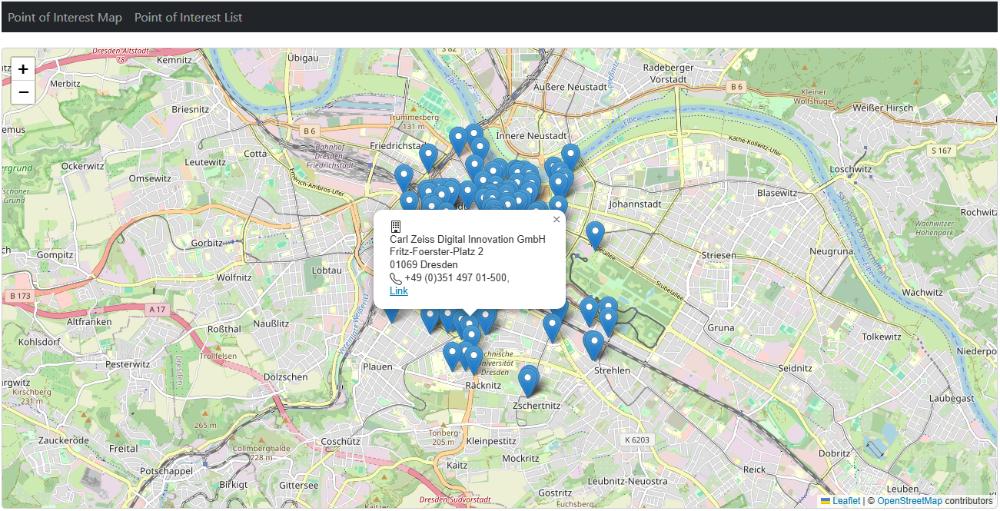

# MongoDB Showcase

[](#license)
[](#)

This repository is a demo application used for an internal campus showing the usage of MongoDBs geospatial index capabilities. The database stores points of interest (POI) that are shown on a map on frontend websites. The websites call backend services that connect to the MongoDB database. To show different ways of working with MongoDB, both multiple backend technologies (.NET Core, JEE/Jakarta) and frontend technologies (Angular, ASP.NET Core MVC) are included in the repo.

## Table of Contents
- [Quickstart](#quickstart)
- [Prerequisites](#prerequisites)
- [Run the demo (fast path)](#run-the-demo-fast-path)
- [Subprojects / Layout](#subprojects--layout)
- [Test data](#test-data)
- [Development notes](#development-notes)
- [License](#license)
- [Contact](#contact)

## Quickstart

These steps will get a local demo running (frontend + example backend + local MongoDB).

1. Start MongoDB (from the `MongoDB` folder)
   - Windows PowerShell:
     ```
     docker-compose -f [docker-compose.yml](http://_vscodecontentref_/6) up -d
     ```
   - Confirm MongoDB is up:
     ```
     docker ps
     ```
   - Of course you can use any other MongoDB installation.
   - For more information (i.e. database prerequisites) see the folders README.

2. Start a backend and the frontend:
   - See each subproject README for exact commands and ports (examples below).

3. Open a frontend in your browser:
   - Angular frontend: http://localhost:4200  
   - ASP.NET Core frontend: http://localhost:4200 (same port for consistency)

<figure style="text-align:center;">
  <a href="angular-maps-frontend/public/media/screenshots/angular_frontend_screenshot.png" target="_blank" rel="noopener">
    
  </a>
  <figcaption style="font-size:0.95em;color:#444;margin-top:6px;">
    Frontend demo: POIs loaded relative to the map center — click to view full-size.
  </figcaption>
</figure>

## Prerequisites
- Docker & Docker Compose (when using the provided Docker files).
- Node.js (for the Angular frontend) and npm/yarn
- Java 21+ and Maven (for the JEE backend and the testdata generator)  
- .NET 9.0 SDK (for the .NET backend and ASP.NET Core frontend)

Its not necessary to have all technologies - select the frontend and backend of your choice.

## Run the demo (fast path — suggested)

### Choose Your Stack
This demo offers multiple technology combinations:

**Frontend Options:**
- **Angular** (`angular-maps-frontend/`) - SPA with TypeScript
- **ASP.NET Core MVC** (`dotnet-maps-frontend/`) - Server-side rendering with Razor + Full CRUD operations (Create, Edit, Delete POIs)

**Backend Options:**  
- **JEE/Jakarta** (`jee-mongodb-backend/`) - Traditional enterprise Java
- **.NET Core** (`dotnet-mongodb-backend/`) - Modern C# async API

### Quick Start Steps
- Start MongoDB:
  - PowerShell:
    ```
    cd MongoDB
    docker-compose up -d
    ```
- Run a backend (choose one):
  - **JEE Backend** (example):
    ```
    cd jee-mongodb-backend
    mvn clean package
    # deployment will depend on how the JEE war is executed; see the sub-README
    ```
  - **OR .NET Backend**:
    ```
    cd dotnet-mongodb-backend  
    dotnet run
    ```
- Run a frontend (choose one):
  - **Angular Frontend**:
    ```
    cd angular-maps-frontend
    npm install
    npm start
    ```
  - **OR ASP.NET Core Frontend**:
    ```
    cd dotnet-maps-frontend
    dotnet run
    # Access at: http://localhost:4200/Map
    ```

Note: exact ports and steps vary by backend. See the subproject READMEs for full, correct commands.

## Subprojects / Layout

- `angular-maps-frontend/` — Angular app that displays POIs on a map and calls the backend for POIs near the current map center. See `angular-maps-frontend/README.md`.
- `dotnet-maps-frontend/` — ASP.NET Core MVC app with full CRUD operations (Create, Edit, Delete POIs). Features interactive maps with Leaflet.js, dual list views (cards/table), synchronized controls between pages, and localStorage-based settings. See `dotnet-maps-frontend/README.md`.
- `jee-mongodb-backend/` — Jakarta (JEE) backend service. Contains REST endpoints and mapping to MongoDB.
- `dotnet-mongodb-backend/` — .NET Core backend service with MongoDB integration. High-performance async REST API. See `dotnet-mongodb-backend/README.md`.
- `MongoDB/` — Docker + compose configuration and initialization scripts. Use this to run a local MongoDB instance.
- `testdata-generation/` — Java tool to parse GPX files and POST POIs to a running backend to populate test data.

## Test data

Use the `testdata-generation` project to generate and POST sample POIs:

- Build the generator:

```
cd testdata-generation
mvn clean package
```

Run with the generated jar (example):

```
java -jar target/geo-service-testdata-generation-1.0-SNAPSHOT.jar
```

See `testdata-generation/README.md` for full options.

## Development notes & tips
- The frontend loads POIs relative to the map center. Adjust backend query parameters to test different geospatial queries.
- The `MongoDB/init-mongo.js` script contains example index creation and sample dataset initialization.
- If you modify backend data models, ensure the frontend and test-data generator still post/consume the same JSON shape.

## License
This project is licensed under the terms of the MIT license. See `LICENSE.md` for details.

## Contact
Maintainers / Authors: see repository metadata or contact the repository owner.